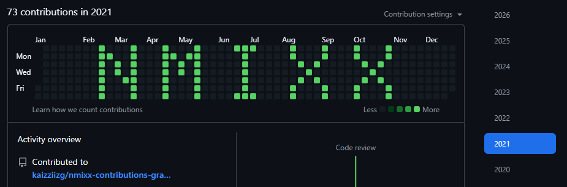

# Git Repo Generator (GitHub Contribution Chart Builder)

This project is a **FastAPI-based tool** that generates a Git repository with commits created at **specific dates and times**, allowing you to shape a GitHub contribution chart.

You provide a list of contributions (date, time, count), and the service:
1. Creates a temporary Git repository
2. Generates commits using the specified timestamps
3. Packages the repository as a `.zip` file
4. Returns it for download

> ✅ Designed to be used together with **[https://tool.gnar.cc/github-contribution-chart-builder](https://tool.gnar.cc/github-contribution-chart-builder)**  
> ⚠️ Please use responsibly and follow GitHub’s terms and community guidelines.

---

## Features

- REST API to generate a Git repository from contribution data
- Precise control over commit `author_date` and `commit_date`
- Automatic ZIP packaging of the generated repository
- Temporary files are cleaned up automatically after download

---

## Tech Stack

- Python 3.9+
- FastAPI
- Uvicorn
- Pydantic

---

## Installation

### 1. Create a virtual environment

```bash
python -m venv .venv
source .venv/bin/activate   # Windows: .venv\Scripts\activate
````

### 2. Install dependencies

```bash
pip install -U pip
pip install fastapi uvicorn gitpython pydantic
```

---

## Run the Server

```bash
uvicorn main:app --host 0.0.0.0 --port 8000 --reload
```

Once running, open:

* Swagger UI: `http://localhost:8000/docs`

---

## API Reference

### POST `/generate-repo`

Generates a Git repository based on the provided contribution data and returns it as a ZIP file.

---

### Request Body Example

```json
{
  "repoName": "my-contrib-repo",
  "user": "Your Name",
  "email": "you@example.com",
  "total": 8,
  "contributions": [
    { "date": "2026-01-01", "time": "12:30:00", "count": 3 },
    { "date": "2026-01-02", "time": "09:10:00", "count": 5 }
  ]
}
```

#### Field Description

| Field           | Description                                              |
| --------------- | -------------------------------------------------------- |
| `repoName`      | Name of the generated repository and ZIP file            |
| `user`          | Git commit author name                                   |
| `email`         | Git commit author email (must match your GitHub account) |
| `total`         | Currently unused (reserved for frontend validation)      |
| `contributions` | List of contribution definitions                         |
| `date`          | Commit date (`YYYY-MM-DD`)                               |
| `time`          | Commit time (`HH:MM:SS`)                                 |
| `count`         | Number of commits to generate at that timestamp          |

---

### Response

* **200 OK** – Returns a `.zip` file containing the Git repository
* **500 Internal Server Error** – Returns error details

---

## cURL Example

```bash
curl -X POST "http://localhost:8000/generate-repo" \
  -H "Content-Type: application/json" \
  -o my-contrib-repo.zip \
  -d '{
    "repoName": "my-contrib-repo",
    "user": "Your Name",
    "email": "you@example.com",
    "total": 8,
    "contributions": [
      { "date": "2026-01-01", "time": "12:30:00", "count": 3 },
      { "date": "2026-01-02", "time": "09:10:00", "count": 5 }
    ]
  }'
```

After extracting the ZIP file, you will have a fully initialized Git repository with commit history.

---

## Using with **github-contribution-chart-builder**

1. Go to **[https://tool.gnar.cc/github-contribution-chart-builder](https://tool.gnar.cc/github-contribution-chart-builder)**
2. Design your GitHub contribution chart pattern
3. Export or copy the generated contribution data
4. Send it to this API (`/generate-repo`)
5. Download and extract the ZIP file
6. Push the repository to GitHub using your account

> GitHub contribution visibility depends on multiple factors:
>
> * Repository ownership
> * Public vs private repository
> * Commit email matching your GitHub account
> * GitHub contribution rules

---

## Notes & Caveats

* This service **does not push** the repository to GitHub.
* Commits are created using:

  * `author_date = YYYY-MM-DDTHH:MM:SS`
  * `commit_date = YYYY-MM-DDTHH:MM:SS`
* All commits append to a single file: `contribution.log`
* Temporary directories are deleted automatically after the response is sent.
* The `total` field is currently unused but kept for compatibility with frontend tools.

---

## License
MIT

